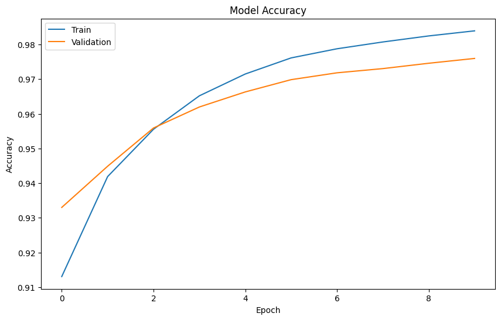
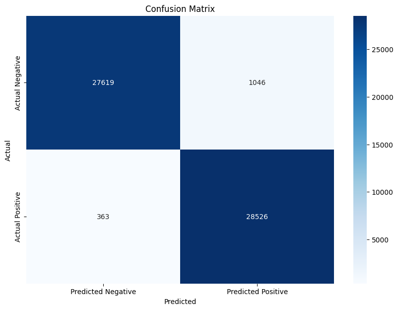

## Toxic Comments Detection

1. Import Libraries
* NumPy for numerical computations
* Pandas for data manipulation and analysis
* Matplotlib and Seaborn for data visualization
* ‘re’ for regular expressions and text processing
* WordCloud for creating word cloud visualizations, 
* Scikit-learn for machine learning model building and evaluation
* TensorFlow/Keras for deep learning models.

2. Load and read, and combine the datasets

3. Exploratory Data Analysis
 * Summary Statistics with decribe method
 * Check data types and missing values
 * Check for duplicate comments and remove them if present
 * Reindex the DataFrame after dropping duplicates
 * Check the distribution of comments, 'Toxic', column and visualise the distribution with bar plot
 * Visualise the common words in toxic and non-toxic comments with Word cloud.
 
 4. Transformation of Data
 *  Data Cleaning: 
 *  Vectorization with TF-IDF transformation
 *  Addressing Class Imbalance with SMOTE

 5. Modelling
 *  Split the the resampled data into training and test sets
 *  Instantiate the deep learning model: A lightweight model, such as a simple neural network with an input layer, a hidden layer containing 64 neurons, and an output layer with a sigmoid activation function for binary classification, uses a dropout rate of 0.5 to help prevent overfitting. The model is optimized using the Adam optimizer with a learning rate of 0.001.
 *  Train the model using 10 epoch, batch size of 32 and validation split of 0.2
 *  Visualize the history to see the training and validation accuracy and loss.
    

    

 6. Evaluation
 
 *  Evaluation on the test dataset the accuracy
 *  Generate predictions, print and visualise classification report
    
 
 *  Visualize the confusion_matrix
    

## Key terms and definitions
 
 ### What is a Vectorizer?

A vectorizer is a tool in natural language processing (NLP) that converts text into numbers that machines can understand. It does this by:

i.   Transforming words into numerical values
ii.  Extracting important features from text
iii. Creating efficient representations of text data

Why Use Vectorizers?

a. To prepare text for machine learning models
b. To capture word importance and relationships
c. To efficiently represent large amounts of text
d. To normalize and scale text data
e. To handle sparse data (text with many unique words)

Vectorizers allow machines to process and learn from text, enabling tasks like text classification and sentiment analysis.

### SMOTE: Synthetic Minority Over-sampling Technique

SMOTE is a method used in machine learning to address imbalanced datasets. It works by:

1. Identifying the minority class (the class with fewer samples)
2. Creating new, synthetic samples of the minority class
3. Adding these synthetic samples to the dataset

This process helps balance the dataset, improving the model's ability to learn from and predict the minority class. SMOTE creates new samples by interpolating between existing minority class samples, maintaining the original data distribution.

By using SMOTE, machine learning models can better handle imbalanced data, leading to more accurate predictions across all classes.
